### Hi there 👋 

**JackelinGM/JackelinGM** is a ✨ _special_ ✨ repository because its `README.md` (this file) appears on your GitHub profile.

* Student at Laboratoria 
* On my way of becoming a Full Stack developer ✨ 

```Javascript
const jackelingm = {
  code: [Javascript, HTML, CSS], 
  tools: [Node, React],
  languages: ["English", "Spanish"]
}
``` 
<div style="display: inline_block"><br>
  
  
  
  
 
</div>
<br>


<div> 
  https://img.shields.io/badge/Gmail-D14836?style=for-the-badge&logo=gmail&logoColor=white
  
  
     
     
  <a href="https://https://twitter.com//Melissa25857581" target="_blank"></a>
 	<a href="https://www.twitch.tv/rafaballerinii" target="_blank"></a>
 <a href="https://discord.gg/pDbY76q8Qf" target="_blank"></a> 
  <a href = "mailto:gutmontemel@gmail.com"></a>
  <a href="https://www.linkedin.com/in/rafaella-ballerini-45875016a" target="_blank"></a> 
  </div>
  
  
  
Here are some ideas to get you started:

- 🔭 I’m currently working on ...
- 🌱 I’m currently learning ...
- 👯 I’m looking to collaborate on ...
- 🤔 I’m looking for help with ...
- 💬 Ask me about ...
- 📫 How to reach me: ...
- 😄 Pronouns: ...
- ⚡ Fun fact: ...


